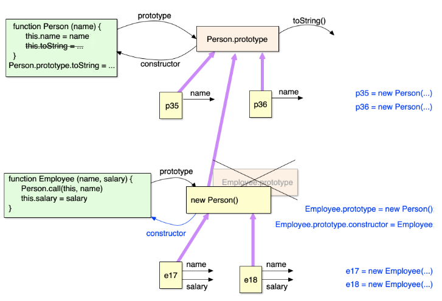
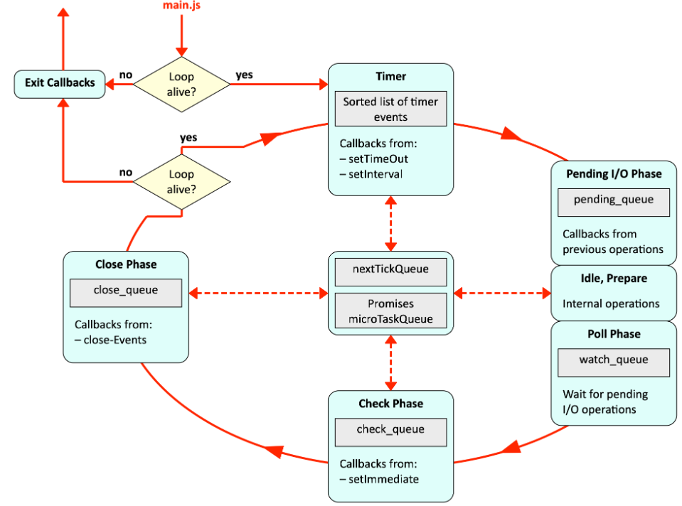

# Links
* https://standardjs.com
* https://bartaz.github.io/ieee754-visualization
* https://eloquentjavascript.net
* https://devdocs.io
* http://latentflip.com/loupe
* https://insomnia.rest
* https://gburkert.github.io/selectors
* https://babeljs.io
* http://latentflip.com/loupe

# MLDM Links
* String Functions: https://developer.mozilla.org/en-US/docs/Web/JavaScript/Reference/Global_Objects/String
* Number Functions: https://developer.mozilla.org/en-US/docs/Web/JavaScript/Reference/Global_Objects/Number
* Array Functions: https://developer.mozilla.org/en-US/docs/Web/JavaScript/Reference/Global_Objects/Array
* Math Functions: https://developer.mozilla.org/en-US/docs/Web/JavaScript/Reference/Global_Objects/Math
* Date Functions: https://developer.mozilla.org/en-US/docs/Web/JavaScript/Reference/Global_Objects/Date

# NodeJS
* NodeJS ist eine ereignisbasierte JavaScript-Laufzeitumgebung
* REPL (Read Eval Print Loop) kann mit ```node``` gestartet werden oder ein JavaScript File kann ausgeführt werden

## REPL
* ```_``` liefert Resultat der letzten Operation
* ```.help``` gibt Hilfe zu Kommandos aus
* ```.load hello-world.js``` ladet ein File in der REPL und führt es aus
* Kommandozeilenargumente: ```process.argv``` (erstes Argument immer Location von node.exe, zweites immer Location vom Script)

# Konsole
```js
console.clear()   // Konsole leeren
console.trace()   // Stacktrace ausgeben
console.time()    // Zeitmessung starten
console.timeEnd() // gibt vergangene Zeit aus, sofern Zeitmessung gestartet wurde
console.error()   // gibt Ausgabe auf stderr aus
```

# Werte
* Wertetypen sind nicht veränderbar (Strings, Zahlen...)
* Zuweisung kann wie Kopieren behandelt werden
```js
// sind nicht veränderbar
let v1 = "Test"
let v2 = v1
v1 += "Test"
console.log(v1) // Test
console.log(v2) // TestTest

// haben ebenfalls Attribute und Methoden haben (wie bei Objekten)
"Zeichenkette".length    // 12
"Zeichenkette"["lenght"] // 12
let name = "Leo"
name.test = "Test"
console.log(name.test)   // undefined (Attribute können auf Wertetypen nicht angepasst werden)
```

## Zahlenwerte
* Zahlentyp: ```Number```
* 64 Bit Floating Point entsprechend IEEE 754
```js
let v1 = 17           // Ganzzahlliteral
let v2 = 3.14         // Dezimalzahlliteral
let v3 = 2.998e8      // Dezimalpunktverschiebung 2.998 * 10^8

let v4 = Infinity     // unendlich z.B. 1/0 = Infinity
let v5 = -Infinity    // minus unendlich z.B. -1/0 = -Infinity
let v6 = NaN          // Not a Number z.B. 0/0

let v7 = 2n           // BigInt Datentyp für grosse Zahlen
let v8 = n7 + 3n
let v9 = BigInt(1)    // 1n
let v10 = Number(1n)  // 1
let v11 = Number('1') // 1
let v12 = Number('a') // NaN
```

## Strings
* Strings sind 16-Bit-Unicode Zeichen
* '' und "" bewirken das gleiche
* Sind Werte
```js
let v1 = 'string1'
let v2 = "string2"
let v3 = v1 + v2

// template strings
let v4 = 15
let v5 = `There are ${v4} people.`
let v6 = `There are ${14/2} people.`

// aus irgendwelchen dämlichen Gründen gibt es zustätzlich auch ein String-Objekt
let v7 = new String('test') // nun eine Referenz; mittels valueOf kann Werte-String herausgeholt werden
```

# ```null``` und ```undefined```
* Sind eigentlich austauschbar
* Null wird eher verwendet, wenn keine Objektreferenz vorhanden ist oder eine Variable explizit keine Objektreferenz zuzuweisen
* undefined wird verwendet, wenn einer Variable noch keinen Wert zugewiesen worden ist
```js
// auf undefined prüfen
let a
if (a === undefined) console.log("undefined #1")
if (typeof a === 'undefined') console.log('undefined #2')
```

# typeof
* Mittels ```typeof``` Operator wird der string des Typs der Variable zurückgegeben
```js
typeof 12        // 'number'
typeof(12)       // 'number'
typeof 2n        // 'bigint'
typeof Infinity  // 'number'
typeof NaN       // 'number'
typeof null      // 'object'
typeof 'number'  // 'number'
typeof undefined // 'undefined'
typeof true      // 'boolean'

typeof 12 === 'number' // true
```

# Operatoren
* Typen werden bei Bedarf vor einer Operation konvertiert
* Insbesondere problematisch ist +, da dieser sowohl zur String konkanitation verwendet wird, als auch zum rechnen
```js
8 * null // führt zu 0, weil null zu 0 konvertiert wird
"5" - 1  // ergibt 4, weil "5" zu 5 konvertiert wird
"5" + 5  // ergibt "55", weil 5 zu "5" konvertiert wird
         // konkatination wird bevorzugt

// werte, die ebenfalls als "false" interpretiert werden können:
[!0, !"", !false, !undefined, !null] // [true,true,true,true,true]

// || und %% operator
undefined || "test" // "test";    liefert den ersten Operanden der als true interpretiert werden kann
undefined && "test" // undefined; liefert den ersten Operanden der als false interpertiert werden kann
```

## ```==``` oder ```===```
* ```==``` führt automatische Typenkonvertierung durch
* ```===``` macht keine automatische Typenkonvertierung
* Gleiche Werte können im Normalfall mit ```==``` verglichen Werten (z.B. Strings)
* Falls Objekte verglichen werden wird mit ```==``` die Referenz verglichen
```js
null == undefined // true (weil null und undefined praktisch austauschbar sind)
'5' == 5          // true, da einer der beiden zum jeweils anderen Typen konvertiert wird
'5' === 5         // false, es findet keine Konvertierung statt

// hier werden Objektreferenzen verglichen
[ []==[], {}=={}, (()=>{})==(()=>{}) ]
[ false, false, false ]
```

# Verzeigungen und Wiederholungen
```js
if (1 > 5) {  // Ausdruck muss nicht unbedingt logischer Natur sein
  // ...      // kann auch von JavaScript zu false konvertiert werden
} else if (5 < 2) {
  // ...
} else { 
  // ...
}

switch (5) { 
  case 1: 
    // ...
    break 
  case 2: 
    // ...
    break 
  default: 
    // ...
    break 
}

for (let i=1; i<50; i*=2) { 
  console.log(i)
}

let v = 5 > 1 ? 1 : 2
```

# ```var```, ```let```, ```const```
```js
// var ist function scope
function varDemo() {
  let x = 10
  if (true) {
    var z = 30
  }
  console.log(x+z) // wird zu 40, da z in der ganzen Funktion vorhanden ist
}

// let ist block scope (wie normalerweise erwartet)

// bei const darf die Referenz oder der Wert nicht geändert werden (ebenfalls block scope)
const v1 = {}
v1 = {} // error
const v2 = "test"
v2 = "testtest" // error

// kann auch komplett weggelassen werden, aber dann ist die Variable Global (sehr sehr sehr hässlich!!)
const add = function(a,b) {
  result = a+b
  return result
}
add(a+b)
console.log(result) // global hier
```

# Funktionen
* Funktionen sind Objekte
* Können als Parameter übergeben werden oder als Rückgabewerte von Funktionen selbst
* Pure Funktionen: Haben keine Seiteneffekte, z.B. mathematische Funktion
```js
let sqr = n => n * n
let sqr = n => {return n*n}
let sqr = (n) => {return n*n}
let sqr = () => n * n
let sqr = function (n) {return n*n}

// Funktionen, die keinen Return Wert haben liefern 'undefined', falls eine Zuweisung stattfindet
let f1 = function () { console.log('test') }
let v1 = f1() // undefined

// Funktionen, die an keine Variable zugewiesen werden, werden vor dem normalen Anweisungsfluss ausgeführt
function f2() {
  console.log('test')
}
f2() // 'test'

// Parameter müssen nicht zwingen übergeben werden
let f3 = function(a,b,c) { console.log(a,b,c) }
f3(1,2,3) // 1 2 3
f3(1,2)   // 1 2 undefined
f3(1)     // 1 undefined undefined

// Es ist ebenfalls möglich, auf eine 'arguments' Variable zuzugreifen, die alle Parameter beinhaltet
// ist kein richtiges Array sondern nur "array-ähnlich"
let f4 = function() { console.log(arguments[0], arguments[1], arguments[2]) }
f4(1,2,3) // 1 2 3
f4(1,2)   // 1 2 undefined
f4(1)     // 1 undefined undefined

// Funktionen können theoretisch auch mit Attributen erweitert werden
let f5 = x => x*x
f5.test = "Hello"
console.log(f5.test) // Hello

// innere Funktionen haben Zugriff auf Variablen in äusserer Funktion
const f6 = function(a,b) {
  const f = function() {
    return a*b
  }
  console.log(f())
}
f6(5,5) // 25

// bei den Parametern können auch default Werte definiert werden
const f7 = function(a,b,c) { console.log(a,b,c=5) }
f7(1,2)   // 1 2 5

// mittels REST Parameter werden n Parameter zum Array umgewandelt
const f8 = function(...params) { for (let param of params) { console.log(param) } }
f8("a","b","c") // printed nacheinander a,b,c

// Closures : Funktionen die in den Gültigkeitsbereich einer Funktion eingeschlossen sind
const f9 = function() {
  let local = n
  let f = () => local
  return f
}
let wrap1 = f9(1)
console.log(wrap1()) // wird 1 ausgeben
```

# Objekte
* Variablen die Objekte beinhalten, haben Referenzen auf dieses Objekt, welche jedes Mal unterschiedlich sind
```js
[ []==[], {}=={}, (()=>{})==(()=>{}) ]
[ false, false, false ]
> [ 3.5==3.5, "abc"=="abc", false==false ]
[ true, true, true ]
```
* Objekte sind Sammlungen von Attribute und Werte
* Attributname und Werte durch Doppelpunkt getrennt
* Attribut-Werte-Paare werden durch Kommas getrennt
```js
let person = {
  name: 'John Baker',
  age: 23,
  'exam results': [6,5,6,6,5]
}

// Zugriff auf Objekte
person.name             // John Baker
person['age']           // 23
person['exam results']  // [6,5,6,6,5]
person.birthday         // undefined
person.birthday.year    // TypeError (da birthday undefined ist)
person.birthday && person.birthday.year // bessere Variante
person.birthday?.year   // neu eingeführt seit ES2020
let o1 = {a: 1, b: 2}
let {a,b} = o1          // a = 1 , b = 2

// Objekte erweitern, Attribute löschen, Existenz prüfen
person['birthday'] = '11-04-1997'
person.height = 193
delete person.name
'name' in person        // false
'age' in person         // true

// Methoden (Funktionen innerhalb von Objekten)
let cat = { name: 'James', meow: function() { console.log('Meow from ' + this.name) } }
cat.meow()              // Meow from James

// Objekte zusammenführen (zweites Argument wird in das Objekt des ersten Arguments eingefügt)
let o1 = {a: 1, b: 2}
let o2 = {c: 3, d: 4}
let o3 = Object.assign(o1,o2) // { a: 1, b: 2, c: 3, d: 4 }
let o4 = Object.assign({},...o1)
o1 == o4 // false, da ein komplett neues Objekt erstellt wurde beim ersten Argument im letzten Object.assign()

// keys und values
let o5 = {a: 1, b: 2}
Object.keys(o5)         // [ 'a', 'b' ]
Object.values(o5)       // [ 1, 2 ]

// Objekte können auch bei Funktionsparametern destrukturiert werden
let o5 = {a:1,b:2,c:3}
let f1 = ({a,b}) => a*b
f1(o5) // 2 (wegen 1*2)

// Ein Objekt kann ohne Angabe eines Attributes mit einer Variable initalisiert werden
let type = 'white'
let o6 = { type } // { type: 'white' }
```

## ```this```
* this bezieht sich auf das aktuelle Objekt
* Bedeutung ist abhängig davon, wo es herkommt: Methodenaufruf, Funktionsaufruf, apply, call oder bind, Konstruktoraufruf
```js
// Methodenaufruf
let o1 = {
  type: 'white',
  speak: function(line) { console.log(`The ${this.type} rabbit says: ${line}`) }
}
o1.speak('I hate my life.') // The white rabbit says: I hate my life.

// Funktionsaufruf
// this bezieht sich hier auf das globale Objekt (oder window in Browser)
// wird verhindert mittels "use strict" am Anfang oder in der Funktion
function speak(line) {
  console.log(`The ${this.type} rabbit says: ${line}`) 
}
speak('I hate my life.') // The undefined rabbit says: I hate my life.

// call und apply
let o2 = { type: 'white' }
speak.call(o2, 'I hate my life.') // zweites Argument: Funktionsargumente
speak.apply(o2, ['I hate my life.']) // zweites Argument: Array mit Argumenten

// bind
let newSpeak = speak.bind(o2) // neue Instanz mit gebundenem this wird erzeugt
newSpeak('I hate my life.')
```
* Arrowfunktionen: ```this``` bezieht sich auf den umgebenen Gültigkeitsbereich
```js
// in diesem Beispiel wird auf das this im Gültigkeitsbereich der Funktion zugegriffen
function normalize() {
  console.log(this.coords.map(e => e / this.length)) // [ 0, 0.4, 0.6 ]
  console.log(this.coords.map(function(e) { return e / this.length })) // [ NaN, NaN, NaN ]
}

normalize.call({coords: [0, 2, 3], length: 5})
```

## Prototypen
* Prototypen definieren verschiedene Fallback Attribute und Methoden, die immer vorhanden sind, auch wenn das Objekt leer ist
```js
// Object.getPrototypeOf()
Object.getPrototypeOf({}) == Object.prototype         // true
Object.getPrototypeOf([]) == Array.prototype          // true
Object.getPrototypeOf(() => {}) == Function.prototype // true

// Object.create()
// kreiert ein Objekt mit dem mitgegeben Prototype
let o1 = Object.create({hello:'world'})
Object.getPrototypeOf(o1) // {hello:'world'}
```
## Konstruktoren
* Mittels Konstruktoren kann ein neues Objekt mit ```new``` erzeugt werden wobei ```this``` dann direkt aufs neue Objekt zeigt
* Konstruktoren sollten immer gross geschrieben werden
```js
function Person(name) {
  this.name = name
}

// es wird automatisch ein Person.prototype erstellt
// jede erstellte Person erbt nun die Attribute von Person.prototype
// auf Person.prototype gibt es ein constructor Attribut, dass auf die Person zeigt
let p = new Person('James')
Object.getPrototypeOf(p) == Person.prototype // true
Person.prototype.constructor == Person       // true

// es kann nun zum Beispiel auf dem Person.prototype eine toString Methode
// erstellt werden, dann hat jede Person eine toString Methode
Person.prototype.toString = function() { console.log(`Name of the person: ${this.name}`) }
```
## Vererbung mit Prototypen
* Im Beispiel soll "Employee" von Person erben
* Dazu wird der Employee.prototype mit "new Person()" ersetzt
* Und zusätzlich wird dann auf dem Employee.prototype das Konstruktor Attribut auf "Employee" gesetzt
```js
function Person(name) {
  this.name = name
}
function Employee(name, salary) {
  Person.call(this, name) // Aufruf des Konstruktors in Person
  this.salary = salary
}

this.prototype = new Person()
Employee.prototype.constructor = Employee

let emp = new Employee('James', 7000)
```



## Klassensytax
* Syntactic Sugar für Prototype Vererbung seit ES6
```js
class Person {
  constructor(name) {
    this.name = name
  }
  toString() {
    return `Person with name ${this.name}`
  }
}

class Employee extends Person {
  constructor(name, salary) {
    super(name)
    this.salary = salary
  }
}

let emp = new Employee('James', 7000)

// getter und setter
class HourlyEmployee extends Employee {
  constructor(name, hourlySalary) {
    super(name, hourlySalary)
    this.hours = 0
  }

  get workedHours() { return this.hours }
  set wokredHours(hours) { this.hours += hours }
}

let hemp = new HourlyEmployee('Leo', 30)
hemp.wokredHours = 10
hemp.wokredHours = 10
hemp.wokredHours = 5
console.log(hemp.workedHours) // 25

// funktioniert auch bei normalen Objekten
const language = {
  set current(name) {
    this.history.push(name)
  },
  history = []
}

language.current = 'DE'
language.current = 'FR'
console.log(language.history) // ['DE', 'FR']
```

## Arrays
* Arrays sind ebenfalls spezielle Objekte
* Es gibt häufig auch "Array ähnliche" Objekte, die zwar wie ein Array funktionieren, aber kein richtiges Array sind (überprüfung auf Echtheit mit ```Arrays.isArray()```)
```js
// Zugriff auf Arrays
let a1 = [1,2,3]
a1[0]           // 1
a1[100]         // undefined
let [a,b] = a1  // a = 1 , b = 2 (Destrukturierung)

// Arrays erweitern
let a2 = [1,2,3]
a2[6] = 99 // [1,2,3,<empty>,<empty>,<empty>,99]
a2.length  // 7

// Array Funktionen
// https://developer.mozilla.org/en-US/docs/Web/JavaScript/Reference/Global_Objects/Array
let a3 = [1,2,3]
a3.push(4)        // [1,2,3,4]
a3.pop()          // [1,2,3]
a3.unshift(0)     // [0,1,2,3]
a3.shift()        // [1,2,3]
a3.indexOf(2)     // 1
a3.lastIndexOf(2) // 1
a3.slice(0,2)     // [1,2]
a3.concat([4,5])  // [1,2,3,4,5]

// Arrays können verschiedene Typen haben
let a4 = ['1',2,{a: 1, b: 2}]

// Arrays sind spezielle Objekte, prüfen ob Array mit Arrays.isArray()
typeof a4           // 'object'
Arrays.isArray(a4)  // true

// Loop over Arrays
for (let i = 0; i < myArray.length; i++) {
  // ...
}
for (let entry of myArray) {
  // ...
}

// Destrukturierung funktioniert auch bei Parametern
let a5 = [1,2,3]
let f1 = ([a,b]) => a*b
console.log(f1(a5)) // 2 (wegen 1*2)

// Sofern Zugriff nicht über Index erfolgt, wird wie bei einem Objekt ein neues Attribut angelegt
let a6 = [1,2,3]
a6['test'] = 'hello'
a6 // [1,2,3,test:hello]

// Array Funktionen
let a7 = [1,2,3,4,5]
a7.forEach(e => console.log(e)) // printed alle Elemente, lässt Leere aus
a7.filter(e => e > 3) // gibt neues Array zurück, mit angewanten Filter
a7.map(e => e * e) // gibt neues Array zurück mit applizierter map Funktion auf jedes Element
a7.reduce((curr,next) => curr + "" + next) // curr ist immer aktueller Stand, next das nächste Element, gibt 12345 aus
```

## JSON
* JSON ist ein String-Format, dass im Prinzip nichts anderes als JavaScript Objekte darstellt
* Einige Ausnahmen: z.B. Methoden können natürlich nicht serialisiert werden
```js
// JavaScript Objekt -> JSON
let object = {a:1,b:2,c:3}
let json = JSON.stringify(object)

// JSON -> JavaScript Objekt
object = JSON.parse(json)
```

# Modulsystem
* Es gibt zwei Modulsysteme: CommonJS und ES6

## CommonJS
* Ein Export:
```js
// car-lib.js
const car = { brand:'Ford', model:'Fiesta' }

module.exports = car

// other file
const car = require('./car-lib')
```
* Mehrere Exports:
```js
// car-lib.js
const car = { brand:'Ford', model:'Fiesta' }
const truck = { brand:'Man', model:'Big' }

exports.car = car
exports.truck = truck

// other file
const car = require('./car-lib').car
const truck = require('./car-lib').truck
```
* Falls kein absoluter oder relativer Pfad => Annahme: build-in Module oder node_module
```js
// falls kein relativer oder absoluter Pfad -> build-in Modul oder node_modules Modul
const readline = require('readline')
```

## ES6
```js
/* square.js */
const name = 'square'
function draw (ctx, length, x, y, color) { ... }
export { name, draw }

/* other js file */
import { name, draw } from './modules/square.js'
```

# File-API
TODO: Maybe?

# Async Programming
* JavaScript-Code wird in einem Thread ausgeführt
* Ablauf:
  * Script wird ausgeführt mit Funktionsaufrufen -> Callstack
  * Callbacks von asynchronen Operationen werden in Event Queue abgelegt
  * Sobald Stack leer: Übergang in Event Loop bis Event Queue leer

## Event Loop
* Annahme: Es gibt nur eine Event Queue (praktisch gibt es mehrere)



* Timer:
  * Sind für Callbacks für Zeitgeber: ```setTimeout``` oder ```setInterval```
  * Sortierte Liste (keine Queue) nach Zeitstempel
  * Abbruch nach systemspezifischem Limit
* Pending I/O:
  * Aufgeschobene Callbacks von vorherigen Durchgängen (```pending_queue```), z.B. TCP Fehlermeldungen
* Poll Phase
  * Abarbeiten der ```watch_queue```, warten auf I/O Verbindungsanfragen
  * Wartezeit abhängig vom Fullstand der ```check_queue``` oder nach systemspezifischem Limit
* Check Phase
  * Abarbeiten der ```check_queue``` z.B. Callbacks von ```setImmediate```
* Close Phase
  * Vearbeitung bestimmter close-Events (```close_queue```) z.B. ```socket.on('close', ...)```
* nextTickQueue und Promises
  * Sind nicht des Event Loops und werden so früh wie möglich abgearbeitet
  * ```nextTickQueue```: Verarbeitet nextTick Events
  * ````Promises```

```js
// Code wird zu einem späteren Zeitpunkt ausgeführt (entfernen mit clearTimeout)
setTimeout(() => {
  console.log('setTimeout')
}, 5000) // nach 5 Sekunden

// Callback wird alle n Sekunden in die Callback Queue eingeführt
setInterval(() => {
  console.log('setInterval')
}, 5000) // alle 5 Sekunden

// Für Callbacks, die direkt nach der Poll Phase ausgeführt werden sollen
setImmediate(() => {
  console.log('setImmediate')
})

// process.nextTick für möglichst frühe Ausführung
// Beispiel unten: nexttick, immediate, timeout (da immediate direkt nach der poll_phase kommt)
fs.readFile("nexttick.js", () => {
  setTimeout(() => { console.log('timeout'); }, 0)
  setImmediate(() => { console.log('immediate'); })
  process.nextTick(() => { console.log('nexttick'); })
})

// anderes Beispiel: nexttick, timeout, immediate (da timeout im Event Loop zuerst kommt)
setTimeout(() => { console.log('timeout'); }, 0)
setImmediate(() => { console.log('immediate'); })
process.nextTick(() => { console.log('nexttick'); })
```

## "Events" Modul
* EventEmitter verwaltet Listen von Listenern zu bestimmten Events
* Bei Auslösung der Events folgt synchron und in der Reihenfolge, wie sie hinzugefügt wurden
* this referenziert die EventEmitter instanz
```js
const EventEmitter = require('events')
const door = new EventEmitter()

door.on('open', () => {
  console.log('Door was opened')
})
door.on('open', (speed) => {
  console.log(`Door was opened, speed: ${speed || 'unknown'}`)
})

door.emit('open')
// Door was opened
// Door was opened, speed: undefined

door.emit('open', 'slow')
// Door was opened
// Door was opened, speed: slow
```

## Promises
* Promises sind Platzhalter für einen Wert, der voraussichtlich erst später verfügbar sein wird
* Mögliche Zustände: Pending (Ausgangszustand) -> Fulfilled (erfolgreich abgeschlossen) oder Rejected (ohne Erfolg abgeschlossen)
* ```then``` und ```catch``` geben selbst wieder eine Promise zurück
```js
// Promise kann erstellt werden mit new Promise
// Argument: Funktion, welche eine resolve und reject Methode als Argument enthält
// Entweder kann nun von der inneren Funktion resolve oder reject aufgerufen werden

let p1 = new Promise((resolve, reject) => {
  setTimeout(resolve, 500)
  setTimeout(reject, 300)
})

// hier wird "catch" ausgegeben, weil reject zuerst aufgerufen wird vom timeout
p1
.then(() => console.log('then'))
.catch(() => console.log('catch'))

// mit Promise.resolve() wird Promise direkt resolved
// mit Promise.reject() wird Promise direkt rejected
Promise.resolve('hello world').then((data) => console.log(data)) // hello world
Promise.reject('hello world').catch((data) => console.log(data))

// Beispiel mit Verkettung:
var promise = new Promise((resolve, reject) => {
  throw Error('fail')
  resolve()
})
promise
.then (() => console.log('step1'))
.then (() => {throw Error('fail')})
.then (() => console.log('step2'))
.catch(() => console.log('catch1')) // 1. aufgrund von "throw Error('fail')"
.then (() => console.log('step3'))  // 2. aufgrund von normaler Ausführung des Promises aus dem catch()
.catch(() => console.log('catch2'))
.then (() => console.log('step4'))  // 3. aufgrund von normaler Ausführung des Promises aus dem then()

// Event-Loop Verarbeitung
Promise.resolve().then(() => console.log('promise resolved'))
setImmediate(() => console.log('set immediate'))
process.nextTick(() => console.log('next tick'))
setTimeout(() => console.log('set timeout'), 0)

// next tick
// promise resolved
// set timeout
// set immediate

// mit Promise.all() kann auf die Erfüllung von mehreren Promises gewartet werden
// mit Promise.race() kann auf die Erfüllung von mindestens einem Promise gewartet werden
var p1 = new Promise((resolve, reject) => {
  setTimeout(resolve, 200, 'first')
})
var p2 = new Promise((resolve, reject) => {
  setTimeout(resolve, 400, 'second')
})

Promise.all([p1, p2])
.then((data) => console.log(data)) // ['first', 'second'] (Promise erzeugt Array mit allen Resultaten)
.catch(console.log)

Promise.race([p1, p2])
.then((data) => console.log(data)) // first
.catch(console.log)
```

# JavaScript im Browser
```html
<!-- JavaScript Code importieren -->
<script>alert('hello world')</script>
<script src="code/hello.js"></script>
<script type="module" src="code/date.js"></script>
```
* JavaScript Code ist im Browser eingeschränkt: z.B. kein Zugriff auf Filesystem, Zwischenablagen etc.
* Wichtige vordefinierte Objekte im Browser:
  * ```document```, ```window```, ```event```, ```history```, ```location```, ```navigator```
```js
// document
// https://developer.mozilla.org/en-US/docs/Web/API/Document
// Representiert die angezeigt Website, Einstieg ins DOM (Document Object Model)
document.cookies      // Zugriff auf Cookies
document.lastModified // Zeit der letzten Änderung
document.links        // Verweise der Seite
document.images       // Die Bilder der Seite
document.body         // Liefert body Element

// window
// https://developer.mozilla.org/en-US/docs/Web/API/Window
// Repräsentiert das Browserfenster und ist das globale Objekt im Browser
// globalThis zeigt auf beiden Plattformen auf das globale Objekt
window.document     // Zugriff aufs Dokument
window.history      // Zugriff auf Historie
window.innerHeight  // Höhe des Viewports
window.pageYOffset  // vertikal gescrollte Pixel

// navigator
// https://developer.mozilla.org/en-US/docs/Web/API/Navigator
// Repräsentiert den State und Identity des User Agents
navigator.userAgent // 'Mozilla/5.0 (Windows NT 10.0; Wi...
navigator.language  // de
navigator.platform  // Windows
navigator.onLine    // true

// location
// https://developer.mozilla.org/en-US/docs/Web/API/Location
// Represäentiert die Location (URL)
location.href     // https://duckduckgo.com
location.protocol // https
```

## Document Object Model (DOM)
* DOM ist ein Baum, dass jedes Element auf der Website beinhaltet
* Jeder Knoten des Baumes entspricht einem Element auf der Website
* Jeder Knoten besitzt ein nodeType Attribut:
  * 1 -> Node.ELEMENT_NODE (Elementknoten)
  * 3 -> Node.TEXT_NODE (Textknoten)
  * 8 -> Node.COMMENT_NODE (Kommentaroknoten)
* HTML-Elementobjekte sind spezieller als normale XML basierten Elementknoten (Elementobjekte)
  * https://developer.mozilla.org/en-US/docs/Web/API/Node
    * https://developer.mozilla.org/en-US/docs/Web/API/Element
      * https://developer.mozilla.org/en-US/docs/Web/API/HTMLElement


### Elemente Abfragen / Auffinden
```js
// childNodes -> liefert Instanz von NodeList
// liefert Instanz von NodeList mit allen Objekte die unter dem Element vorkommen
document.getElementById('example').childNodes

// children
// liefert Instanz von HTMLCollection mit nur den obersten Objekten direkt unter dem abgefragten Objekt
document.getElementById('example').children

// diverse Möglichkeiten, um DOM abzufragen
document.getElementById('example')
document.getElementsByTagName('p')
document.getElementsByClassName('example')

// querySelector
// liefert erstes passendes Objekt für gegebenen CSS-Selektor
document.querySelector('p')

// querySelectorAll
// liefert alle Objekte für den gegebenen CSS-Selektor
document.querySelectorAll('p')

// className
// liefert Klassennamen als normalen String
document.getElementById('example').className

// classList
// liefert alle definierten Klassen als Array
document.getElementById('example').classList
```

### Elemente hinzufügen / Dokument anpassen
```js
// document.createElement
// erstellt ein neues HTML Element
document.createElement('p')

// document.createAttribute
// Erstellt Objekt, dass das Attr Interface implementiert und mittels setAttributeNode() gesetzt werden kann
let attr = document.createAttribute('style')
attr.value = 'color:blue'
let el = document.getElementById('example')
el.setAttributeNode(attr)

// document.createTextNode
// Kreiert ein Node vom Typ TEXT_NODE
let textNode = document.createTextNode('hello world')
document.getElementById('example').appendChild(textNode)

// <element>.setAttribute
// auf einem Element kann ein Attribut gesetzt werden
document.getElementById('example').setAttribute('style', 'color:red')

// <element>.appendChild
// dem Element wird das angegebene Element angehängt
let p = document.createElement('p')
p.innerText = 'Hello World'
document.getElementById('example').append(p)

// <element>.insertBefore
// erlaubt das Einfügen eines Elementes vor dem anderen angegebenen Element
let p2 = document.createElement('p')
p.innerText = 'Hello World 2'
document.getElementById('example').insertBefore(p, p2)

// remove
let el = document.getElementById('example')
el.remove()
```

### Eigene Attribute
```html
<p data-id="1">Hello World</p>
<p data-id="1">Hello World</p>
```
```js
let pElements = document.getElementsByTagName('p')
for (let pElement of Arrays.from(pElements)) {
  console.log(pElement.dataset.id)
}

// 1
// 2
```

### CSS und DOM
```js
// Style Anpassung
let el = document.getElementById('example')
// alle CSS Anweisungen sind in JavaScript mit Camel-Case anstatt mit Bindestrich
el.style.fontFamily = 'Arial'

// Attribute
el.clientWidth  // Breite inkl. Padding
el.clientHeight // Höhe inkl. Padding
el.offsetWidth  // Breite inkl. Border (ohne margin)
el.offsetHeight // Höhe inkl. Border (ohne margin)
```

## Event Handling
* Es können Events auf Objekten registriert werden
  * `click`: Listener reagieren auf click events
  * `mousedown`, `mouseup`, `click`, `dblclick`, `mousemove`, `touchstart`, `touchmove`, `touched` 
  * `keydown`: Drücken von Tasten (Zugriff auf Taste mit `e.key`)
  * `keyup`: Lösen der Tasten
    * Bei Tastatur Events werden diejenigen Elemente abgehört, die gerade den Fokus besitzen (z.B. für Input-Elemente das ausgewählte Feld)
  * `scroll`: Für Scrollereignisse (mit `pageYOffset` und `pageXOffset` auf dem Event-Objekt)
  * Event-Typen ohne Event-Propagation:
    * `focus`, `blur`: Fokus erhalten/verlieren
    * `load`: Seite wurde geladen (ausgelöst auf `window` und `document.body`)
    * `beforeunload`: Bevor Seite verlassen wird
```js
// addEventListener
// Event Listener auf Objekt hinzufügen (erstes Argument: Event-Typ, zweites Argument: Callback Funktion)
let el = document.getElementById('example')
el.addEventListener('click', function(e) {
  console.log('click')
})

// removeEventListener
// Event Listener von Objekt entfernen (erstes Argument: Event-Typ, zweites Argument: Callback Funktion)
function click() { console.log('click') }
el.addEventListener('click', click)
el.removeEventListener('click', click)

// on<event> : erlaubt direktes Registrieren von Event-Callbacks
// Nachteil: nur eine Funktion möglich
el.onclick = () => console.log('click')

// target und currentTarget
let el = document.getElementById('example')
el.addEventListener('click', function(e) {
  console.log(e.target)        // Element, auf welchem das Event ausgelöst wurde
  console.log(e.currentTarget) // Element, auf welchem der Event-Listener registriert wurde
})

// preventDefault
// verhindert das Default-Verhalten bei Events (zum Beispiel bei <a> Elementen)
// <a href="https://duck.com">duck.com</a>
document.querySelector('a').addEventListener(e => {
  e.preventDefault() // Weiterleitung auf "duck.com" wird verhindert
})
```
### Weitergabe von Events:
* Events werden weiter nach oben gereicht, wenn das Parent-Objekt ebenfalls ein Event Listener registriert hat
* Im Beispiel unten wird erst der Event Listener auf dem `<button>` Element ausgeführt und anschliessent auf dem `<p>` Element
* Mittels `event.stopPropagation()` kann die Weiterreichung verhindert werden
```html
<p>A paragraph with a <button>button</button>.</p>
```
```js
document.querySelector("p").addEventListener("mousedown", () => {
  console.log("Handler for paragraph.")
})
document.querySelector("button").addEventListener("mousedown", event => {
  console.log("Handler for button.")
  if (event.button == 2) event.stopPropagation() // wird verhindern, sofern Klick von rechter Maustaste stammt
})
```

## Bilder und Grafiken
* SVG:
  * Erlauben das Zeichen von Vektorgrafiken
  * Beispiel für SVG:
```html
<p>Normal HTML here.</p>
<svg xmlns="http://www.w3.org/2000/svg">
  <circle r="50" cx="50" cy="50" fill="red"/>
  <rect x="120" y="5" width="90" height="90"
stroke="blue" fill="none"/>
</svg>
```
* Canvas:
  * Erlauben das Zeichnen von Pixelgrafiken
  * Beispiel für Canvas (Zeichnung eines Dreiecks):
```html
<canvas></canvas>

<script>
  let cx = document.querySelector("canvas").getContext("2d")
  cx.beginPath()
  cx.moveTo(50, 10)
  cx.lineTo(10, 70)
  cx.lineTo(90, 70)
  cx.fill()
</script>
```

## Webstorage
* Möglichkeiten: `Cookies` und `LocalStorage`
* `Localstorage` bleibt nach Schliessen des Browser erhalten
* Alternative für solange Browser/Tab geöffnet: `SessionStorage`
* Speicherlimit pro Website (pro Domain): 5MB
```js
localStorage.setItem("username", "bkrt")
console.log(localStorage.getItem("username")) // → bkrt
localStorage.removeItem("username")
```

## Formulare
* Ermöglichen Benutzereingaben im Web
* `action` definiert den Punkt, an welchem der Formular Request gesendet werden soll
* `action` kann auch leer sein, wenn Formular nicht abgesendet werden soll
* `label` beschreibt das Formular-Element
* Formular-Elemente: `text`, `password`, `checkbox`, `radio`, `url`, `email`, `range`, `date`, `search`
* `disabled` verhindert die Eingabe von Text in Input-Element
* Event-Typen: `change`, `input`, `keydown`, `keypress`, `keyup`, `submit`
* Formulare werden mit einem Element mit `type="submit"` abgesendet
```html
<form action="/login" method="post">
  <label for="username">Username:</label>
  <input type="text" id="username">
</form>
```
* Fokus:
  * Element, das gerade Tastatureingaben aufnimmt
  * Anpassbar mit Methoden `focus()` oder `blur()` auf Input-Element
  * Abfragbar mit `document.activeElement`
  * Reihenfolge des Fokus kann mittels `tabindex` gesteuert werden

## Cookies
* HTTP ist als Zustandslos konzipiert, Cookies dienen zur Speicherung von Informationen beim Client
* Zugriff per JavaScript möglich (ausser HttpOnly-Flag ist gesetzt)
```js
// Abfrage der Cookies
let allCookies = document.cookie
```

## Ajax und Fetch-API
* Mittels Ajax ist es möglich, Daten ohne kompletten Reload der Seite nachzuladen
* Mit Fetch-API sind Abfragen möglich
* Attribute des `response` Objektes: `headers`, `status`
* Same origin Policy erlaubt keinen Zugriff auf Daten von anderen Servern (aus Sicherheitsgründen)
* Server kann Zugriff erlauben mit folgendem Header: `Access-Control-Allow-Origin: *`
```js
// Abfrage von API-Daten mit JSON
fetch('api/data', {
  method: 'GET'
})
.then(response => response.json())  // fetch Promise ist direkt erfüllt, daher liefert response.json() eine weitere Promise
.then(json => {                     // das nächste Promise wird erfüllt, sobald die Response geparsed ist
  // ...
})

// Abfrage von API-Daten als reiner Text
// Abfrage von API-Daten mit JSON
fetch('api/data', {
  method: 'GET'
})
.then(response => response.text())
.then(text => {
  // ...
})

// PUT Abfrage an server
fetch('api/data/update', {
  method: 'PUT',
  headers: { 'Content-type': 'application/json' },
  body: JSON.stringify(obj)
})
``` 

# UI-Bibliothek